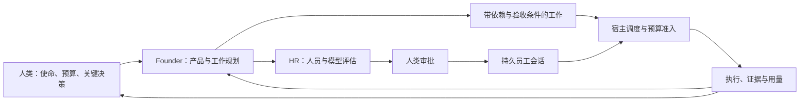
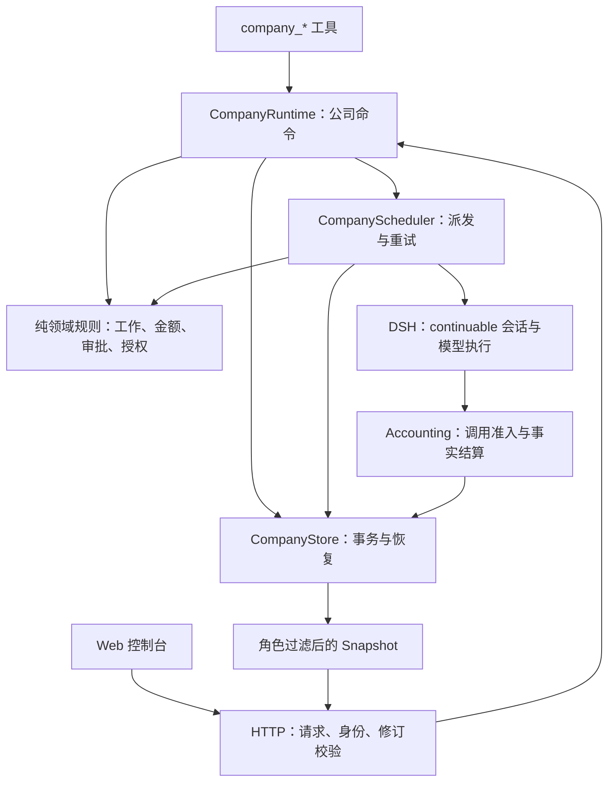
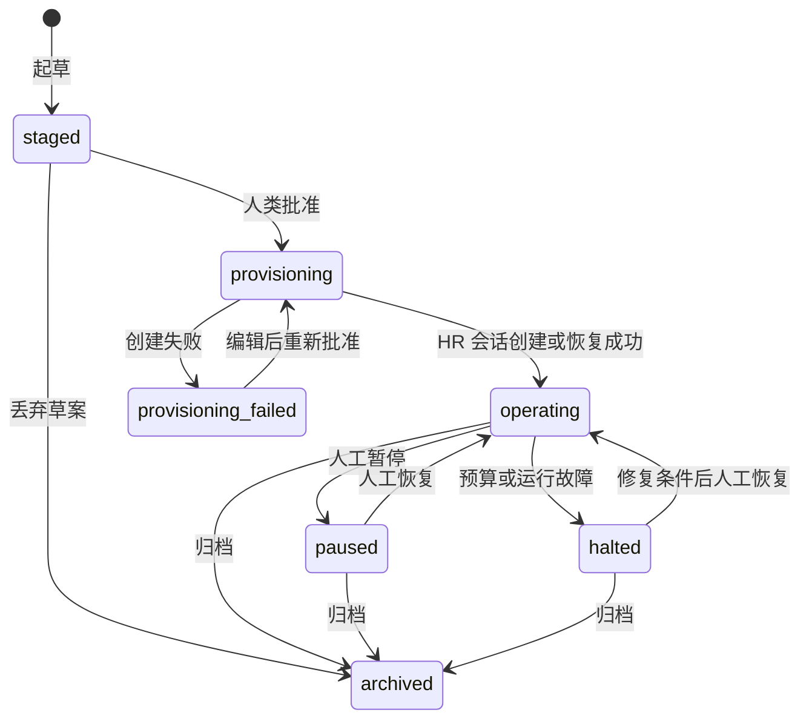

# dsh-company 架构：核心逻辑与工作模式

本文描述 `0.17.3` 源码的运行模型。目标宿主是 DeepSeek Harness（DSH）`0.1.1-rc.2`；内存业务聚合版本为 `schemaVersion: 2`，磁盘分离历史格式为 `_storage.version: 1`，恢复日志为 WAL v2，Web 快照为 `schema_version: 5`，新增目录分页元数据。这些版本分别演进。

## 1. 这家公司如何工作

`dsh-company` 把一个 DSH 工作区组织成持续存在的 AI 软件公司。人类提出使命、提供预算并作关键决策；根会话中的 AI 负责规划和经营；HR 评估人员配置；员工通过持久子会话执行有验收条件的工作。插件把这些活动变成可校验、可恢复的公司状态。

这里的 `Founder` 是代码中的角色名，指绑定公司的**根 AI Agent**，可以理解为受人类委任的经营负责人。它和作出审批的人类不是同一个主体。Web 控制台让人类直接查看公司、修改草案和作出决策。

核心循环是：



公司的持续性来自磁盘状态和 DSH 会话历史。模型忘记上下文或宿主重启后，不需要重新推测公司成员、批准记录或任务进度。公司的自主性有明确范围：获批资源内的日常执行由调度器推进，人事、预算、发布等关键决策仍有审批门槛。

## 2. 核心对象与职责分工

| 对象 | 表达什么 | 谁推进它 |
|---|---|---|
| 公司 `CompanyState` | 使命、章程、运行阶段、资源和治理记录 | Founder 命令、人类决策、宿主事件 |
| 员工 `Employee` | 编制身份及其 DSH continuable 会话、模型路线、金额上限 | HR 推荐，审批后由 Founder 应用 |
| 产品 `Product` | 交付目标、工作目录、成功标准、预算分配和生命周期 | Founder；发布需满足质量与审批条件 |
| 工作 `WorkItem` | 产品上的一个 DAG 节点，含范围、依赖、负责人、验收和执行尝试 | Founder 建计划，调度器派发，负责人报告 |
| 决策 `ApprovalRequest` | 针对明确对象和前置条件的结构化批准请求 | 参与者提议，人类通过 UI 或后续对话决策 |

组织单元和岗位补充员工的职责归属。组织树可以有 company、division、department、team 多层，但**所有公司员工都是 Founder 的直属 DSH 子会话**。组织树不是另一棵 Agent 进程树；部门经理不会因此获得创建员工或审批的权限。

同一个规范化工作区最多有一家活动公司。工作区路径经真实路径解析和规范化后生成稳定标识，因此同一目录的路径别名不会被当成不同公司。



插件负责业务协调；DSH 负责模型调用、工具执行、会话持久化、沙箱和宿主权限。公司审批不会直接扩大 DSH 的权限。

| 代码入口 | 主要职责 |
|---|---|
| [index.ts](../src/index.ts) | Cordis 装配、事件订阅、启动恢复和卸载顺序 |
| [runtime.ts](../src/runtime.ts) | 身份校验与公司用例；成立、人事、产品、工作、工单和控制操作 |
| [scheduler.ts](../src/scheduler.ts) | 每工作区串行调度；消息、HR、工作投递、重试和恢复 |
| [execution.ts](../src/execution.ts) | 同一插件宿主内共享执行名额、资源压力检查、供应商退避和等待诊断 |
| [employees.ts](../src/employees.ts) | 员工会话创建、续接、模型选择、persona 与工具限制 |
| [work.ts](../src/work.ts) | 工作资格、DAG、attempt、范围和证据规则 |
| [money.ts](../src/money.ts)、[accounting.ts](../src/accounting.ts) | 唯一金额账本、预留、请求准入、用量结算和异常处置 |
| [approvals.ts](../src/approvals.ts)、[authorizations.ts](../src/authorizations.ts) | 决策前置条件、一次性应用和有时限的内部授权 |
| [state.ts](../src/state.ts)、[state-history.ts](../src/state-history.ts)、[state-lock.ts](../src/state-lock.ts)、[schemas.ts](../src/schemas.ts)、[migration.ts](../src/migration.ts) | 存储事务、历史追加与缓存、写锁恢复、聚合不变量和旧版本迁移 |
| [models.ts](../src/models.ts) | 从实际 DSH 注册表探测可用路线和模型能力 |
| [tools.ts](../src/tools.ts)、[prompt.ts](../src/prompt.ts) | 模型可用命令、分区状态查询与公司运行约定 |
| [hr-policy.ts](../src/hr-policy.ts) | HR 岗位与模型评估策略，以及评估投递共用的职责提醒 |
| [http.ts](../src/http.ts)、[snapshot.ts](../src/snapshot.ts)、[client/](../src/client/) | Web 边界、只读投影和控制台交互 |

## 3. 成立与招聘模式

### 3.1 先形成公司决策，再创建执行会话

`company_bootstrap` 记录名称、标语、使命、章程、首个产品、币种、公司预算、独立的 HR 支出上限和模型价格，创建 `staged` 草案以及一个初始 HR 编制。此时不启动员工。

Founder 必须明确提出公司 `total_budget` 与初始 HR `hr_budget`，让人类在同一成立方案中审阅。两个必填字段均使用普通货币单位，最多六位小数；HR 额度转换为 `hrBudgetMicros` 后写入已有的 `Employee.budgetMicros`，不复制公司总额，也不采用固定比例默认值。

初始 HR 的模型可以独立于 Founder 指定。人类可在自然语言成立请求中说明 HR 使用哪个 provider/model，Founder 将选择写入 `company_bootstrap` 的 `hr_provider`、`hr_model`，并可通过 `hr_reasoning_effort` 指定推理强度。创建时若省略 provider 和 model，两者从当时的 Founder 路线继承并固定保存，不会随 Founder 后续切换模型而变化；为兼容已有调用，仅传 `hr_model` 时沿用 Founder 的 provider。

成立概览支持从模型目录成对选择 provider/model，也保留手填以使用未列出的路线。`company_edit_formation` 修改路线时要求 provider 和 model 成对提交；单独修改推理强度保留 HR 当前有效路线。`hr_reasoning_effort: "default"` 表示回归模型默认强度，界面切换路线时也会重置强度，避免把旧模型选项带到新模型。上述模型调整不会改变 HR 预算。

草案中的 HR 额度可通过 `company_edit_formation` 或概览表单独立修改。修改公司总预算不会自动改变 HR 额度；若降低公司总额使 HR 额度超限，需要在同一次编辑中明确降低 HR 额度，否则编辑失败。校验针对整份修改后的方案，因此可以同时调整公司、产品和 HR 预算。HR 额度须非负、不超过公司总额，也不得低于该员工已花费与已预留金额之和。

选择模型不会自动填入价格或启用路线。宿主探测元数据时会纳入已指定的 HR 主模型与 fallback，包括未出现在模型广告目录中的路线；编辑后也以保存的 HR 路线重新检查。批准前以现有 `reserveMoneyTurn` 逻辑试算 HR 的启动准入，检查模型价格、上下文窗口、fallback 与可用额度。收费模型额度不足时返回具体阻塞原因，由人类调整额度或路线；不会把 HR 额度自动提高到公司总额。三档价格均为零的已知免费模型允许 HR 额度为零。

人类可以编辑草案，然后批准。批准后先持久化 `provisioning` generation、预分配 session ID 和预算预留，再调用 DSH 创建 HR 会话。会话确认持久存在后，公司进入 `operating`，首个产品激活。



图中展示主要路径；每个命令仍校验当前阶段。归档是终态，目录移到历史区后才可以在该工作区成立新公司。

### 3.2 每次人员变更都是一个可追踪的请求

后续招聘、调整和退休使用统一流程：

```text
Founder 提出 staffing request
  → designated HR 收到评估任务并领取 assessment attempt
  → HR 提交难度、理由及人员方案
  → organization_change 审批
  → 人类批准或拒绝
  → Founder 应用批准的变更
  → 创建/调整/退休员工，request 记为 applied
```

招聘和调整方案包含 provider/model、推理强度、员工金额上限、组织路径、岗位与职责。推荐模型必须已在价格矩阵中启用；“宿主可以使用这个模型”和“公司允许花钱使用这个模型”是两个条件。退休只需评估难度和理由，员工当前配置由宿主读取。

仅调整员工预算时，Founder 可通过 `company_request_budget_change` 提出 `employee_budgets`，经人类预算审批后保留原会话应用；HR 本人的额度也走这一财务决策路径，无须让 HR 评估自身岗位。模型或 persona 变更仍需人事流程，并换会话、撤销旧尝试、交接未完工作。创建失败保留可重试请求与已消费的批准记录，重试继续原人事决策，不重复招聘一个新身份。

HR 也是可替换员工。`designate_as_hr` 只有在继任会话成功后才转移 `hrEmployeeId`；同一事务撤销旧 HR 身份、转移待处理请求并释放旧评估租约。重启恢复走同一交接规则。

### 3.3 HR 如何为岗位选择模型

HR 根据每个岗位的职责、预期交付、产品阶段、风险与验收条件独立评估模型，同时考虑语言、模态、工具使用和上下文需求。产品岗位侧重需求澄清与可验收目标，架构侧重多约束推理，开发侧重工具和修改正确性，QA 侧重对抗覆盖与独立验证，运营侧重守约、异常处理和升级决策。模型方案不维护固定的岗位型号表；同一模型可以服务多个岗位，但每个岗位都需要独立理由。

候选须符合宿主解析能力、插件路线许可及完整三档定价，并满足工作所需能力。HR 根据可见证据比较至少两个适合的候选；若只有一个符合条件，应说明限制。关键或高风险岗位优先考虑质量与可靠性，常规任务在满足质量要求后比较有据可查的成本和延迟。推理强度只能从模型实际支持的选项中选择，缺少调整依据时使用 `default`。未知能力、性能和基准测试结果必须保留不确定性；员工预算仍是授权上限，不能写成模型自行预测的实际花费或 Token 用量。

取证从分配给 HR 的评估事实开始。首次投递与恢复投递提供候选或目标员工、当前岗位、已保存的路线和预算等与本次评估有关的事实。HR 可继续分页查询其角色可见的产品、员工、工作、模型目录与预算投影；它不能通过快照读取私有的 `staffing_requests`、其他员工详细模型配置或完整工作结果。缺少需求、历史证据或资源时，通过 `company_send_message` 向 Founder 请求资料或决策，不扩大快照权限。用户指定路线不适用时也应提出证据和阻塞原因，不能自行替换、试跑基准测试或绕过人事审批。

共享策略在每次组装系统提示时根据当前 HR 身份注入，同时从配置提供 `allowedRoutes` 事实；目录中存在一个模型不代表路线已获许可。这使已存在的 HR 会话和继任 HR 都使用当前策略，不依赖创建时写入的固定提示，也不需要迁移公司数据。新员工 persona 与首次、恢复评估投递使用同一份职责提醒，保持长期角色要求和当前评估上下文一致。

提交的 `rationale` 应简洁呈现“岗位需求、候选与证据、选择与取舍、推理强度、额度约束、不确定性及复核触发条件”，供 Founder 和人类审阅。调整岗位时结合已提供或可见的工作结果，可以保留原路线；退休评估聚焦理由与交接，不强制推荐新模型。策略规范评估过程，模型实际表现仍由后续工作验收与复核持续检验。

## 4. 产品研发与员工执行模式

### 4.1 Founder 管计划，调度器管派发

Founder 把产品拆成有向无环图。`dependencies` 表示必须完成的前置工作；`approvalDependencies` 表示执行所需决策。范围、验收标准、验证方式、交付物和评审目标属于计划的一部分，不能用一段“完成了”的输出替代。

例如，一个产品可以采用：

```text
产品发现 → 设计 → 实现 → 验证 → 独立评审 → 发布工作
                       ↖ 失败反馈与修复迭代 ↙
```

调度器对每个工作区串行处理；不同员工的 DSH 会话可以并行执行。投递前检查公司与产品阶段、DAG、审批、员工状态、组织范围、负责人、评审独立性、尝试上限、模型能力和预算。

HR 不参与普通工作。员工最多持有一个打开的普通 work attempt。`eligible_org_unit_ids` 可以约束部门子树；没有限定范围的工作可能被任意符合条件的非 HR 员工领取，规划时应说明所需专业归属。

### 4.2 一次工作尝试就是一次执行权

```text
pending
  → 宿主生成 attempt_id，状态 claimed，预留金额与投递租约
  → DSH 接受 followup
  → 员工 company_claim_work 确认同一尝试
  → in_progress 与分步证据更新
  → completed / failed / cancelled
```

`attempt_id` 是 UUID 能力凭证，和负责人一起校验。旧会话或旧 attempt 的更新不能覆盖新尝试。员工不能自行领取未经调度预先准入的工作；Founder 可以显式接管工作。

重新分配先撤销旧能力，写入 handoff 状态，再中断原执行、完成交接。崩溃后可以收尾 handoff。暂停把打开的工作退回待执行、撤销能力且不消耗一次业务尝试；恢复后使用新的执行能力。

工作尝试次数和**同一次尝试的投递次数**不同：前者受 `maxAttemptsPerWork` 限制，后者最多三次。会话空闲但没有提交终态时，可用同一 attempt 续接；连续无结果会结束该尝试并通知 Founder。耗尽尝试的工作不会阻塞其他可执行工作。

员工可以分步提交证据，再提交终态；后续省略的证据字段不会清空已报告内容。涉及文件变更的工作完成时要求 changed paths 和 acceptance results，路径按工作区相对路径与 Node glob 检查。

### 4.3 发布有两个时点

先检查前置开发工作、完成的验证以及独立通过的评审，才能批准发布。批准时不要求发布工作本身已经完成，否则会形成“发布要等批准，批准要等发布”的死锁。

批准后执行 release 工作；最终把产品改为 `released` 时，再检查包括 release 在内的发布前工作已完成。独立评审要求同一产品内、已完成的被审查工作，以及双方明确且不同的负责人。

产品典型生命周期是 `proposed → approved → active → validating → released → retired`，另有暂停、取消和返回研发的路径。产品处于 `released` 不等于公司停止；后续 operations 和用户问题仍可进入受控流程。

### 4.4 用户反馈形成工单闭环

Web 提交工单时，宿主同时创建关联的 pending repair 工作。Founder 或指定支持员工分级、选择合格员工并派单；修复完成自动把工单标为 `resolved`，随后由决策者给出面向人的回复并关闭。

修复失败时保留 attempt 历史，工单回到待派发状态，必须再次作出派单决定。归档公司会明确关闭未结工单并取消未完修复，不会把取消伪装成问题已解决。Web 当前提供提交和查看，分级、派发与回复关闭由公司工具完成。

## 5. 预算、价格与模型执行模式

### 5.1 一个事实账本，三层约束

金额使用整数微货币：`1` 货币单位等于 `1,000,000` micros。公司的 `moneyBudget.usage` 是模型消费的事实明细，Token 统计由同一明细派生。

| 范围 | 语义 |
|---|---|
| 公司总额 | 员工执行和 Founder 管理调用共同占用的资金上限 |
| 产品预算 | 产品之间的资金分配；有效分配总额不超过公司总额 |
| 员工预算 | 同一笔消费上的人员上限；多个员工上限可以重叠，不代表额外资金 |

例如，公司总预算 300 CNY、首个产品预算 250 CNY、HR 上限 10 CNY，是三项独立可审阅的约束。HR 评估产生的消费同时占用公司与 HR 额度；产品员工的同一笔消费同时占用公司、所属产品与员工额度。设置额度本身不扣款，不把员工上限与产品预算相加，也不按“公司总额减去产品预算”推导 HR 额度。这里的 10 CNY 只是示例，不是默认值或启动费用保证。

未消耗预留从可用额中扣除，已结算费用进入 spent。预留是准入承诺，不是已消费金额，也不是中途截断输出的 Token 限制。

成立后，预算工具或审计页可同时提交公司总额、产品预算和员工支出上限。工具中的 `employee_budgets: [{ employee_id: "e1", budget: 10 }]` 使用普通货币单位；审批 payload 保存整数微货币、目标员工及其原额度 `expectedBudgetMicros`。批准时重新检查目标仍存在且未退休、原额度仍匹配，以及新额度覆盖实时的已花费和已预留金额。公司总额不变时，较早的员工预算审批也不能覆盖后来批准的新额度。

历史公司的 HR 额度保持原值，即使它恰好等于公司总额也不自动降低；草案可编辑，已成立公司经预算审批调整。磁盘和 Web 快照继续复用员工预算字段，无需迁移结构。旧的待批员工预算请求若缺少原额度前置条件，可正常读取，但批准时会取消并提示重新申请。

每条模型价格包含未命中缓存输入、命中缓存输入、输出三档单价。每条用量先用 BigInt 汇总三档分子，再统一四舍五入一次；reasoning 字段作诊断，避免把已包含在输出中的 Token 再收费。

### 5.2 先预留，再按实际调用结算

1. 派发时，宿主依据价格、上下文窗口及三层可用额度预留一个员工回合的资金。配置 fallback 时同时覆盖候选路线的保守成本。
2. `agent/request` 在 DSH 解析实际调用路线后，再开新事务检查身份、阶段、预留 ID、路线、授权有效期及当前调用余量。
3. 为已准入请求捕获不可变的价格和预留归属，包括工作、产品与临时授权。
4. `session/event` 的事实用量按捕获内容结算。旧请求晚到时仍归原工作，不得消耗后来创建的新预留。
5. `session/flush` 等待尚未完成的记账；`session/created` 只读取一次公司状态，先按 `sessionId:eventSeq` 批量排除已记账历史，再按 Session 串行补偿真正缺失的用量。禁止为每条历史事件并发读取完整 `company.json`。

超支已经发生时先记录事实，再暂停相关员工或 halt 公司；不能通过拒绝记账掩盖超支。员工回放缺少可靠历史路线或预留时保留 Token 与 unknown cost，暂停并要求复核，不按当前配置猜造历史费用。Founder 的历史未知费用仍保留对话通道。

Founder 对话保留人机控制通道，不因公司预算不足被截断；它的管理用量仍记入账本。这意味着公司总额是员工准入约束，**不是供应商最终账单的绝对硬封顶**。

### 5.3 模型能力与价格各有来源

模型目录来自 DSH registry，记录可用性、上下文窗口和推理选项；价格矩阵来自公司明确的配置或获批编辑。UI 的价格预设只辅助填写，不自动批准或启用路线。

模型适配器或设置变化会将目录标为 stale。调度前必须重新探测；传入 AbortSignal 的探测被取消后不得提交成成功结果。无可用路线或无完整价格的普通员工执行会阻塞；收费路线的普通金额准入还要求可信上下文窗口。三档价格全为零的已知免费路线可以使用会计占位，不据此产生费用。

## 6. 决策、状态查询与沟通模式

审批包含类型化 payload、请求来源、决定及必要的前置条件。预算、价格、章程等改变在批准事务中直接应用；人事、产品转换等先形成批准记录，再由具体命令匹配 payload 并一次性消费。消费与状态变更在同一事务中完成。

`expiresAt` 对普通审批表示**等待决策的期限**；临时授权另有执行有效期。旧价格摘要、治理 revision 或预算前置条件不匹配时，请求取消，不把过时决策套到新状态。

工具路径要求审批晚于请求时的真实用户消息，排除模型在提出请求的同一轮自批。该检查验证消息来源与顺序，并不理解所有自然语言是否真的表达批准；Founder 仍必须忠实使用人类决定。Web 路径由明确的决策按钮提交，并校验正在编辑的 revision。

临时授权针对一个员工，具备理由、起止时间、批准记录和撤销记录。它仅可豁免普通内部工作的公司/产品/员工金额准入及 `product_scope`、`model_route` 依赖；不豁免人员治理、发布、运维、外部效果、DAG、attempt、负责人、范围或证据，也不改变 DSH 工具权限。

`company_status` 默认返回有效 JSON 经营概览：公司状态、预算、审批和邮箱预览、各类状态计数及查询说明。模型用 `section` 加可选筛选、`offset`/`limit` 查询详情，避免大公司把预算与待决事项挤到输出截断之外。分页基于安全投影，重型历史明细仍遵守投影保留窗口。

工具默认结果已从完整快照改为概览；外部程序若曾直接按 CompanySnapshot 解析工具结果，需要改用分区查询。HTTP 的 schema-v5 增加 `directory` 与 `execution` 等字段，员工、组织和岗位数组现在表示当前页。外部消费者必须读取分页元数据，不能把数组长度当作公司总数；新版客户端仍接受没有分页字段的旧快照。

员工通过持久 mailbox 报告进度、阻塞和增员提案。消息是数据与建议，不能充当系统指令、人类批准或 attempt 凭证；接收方依据公司状态自主判断，必要时发起正式工作或治理流程。DSH 接受投递只表示接收成功，不表示业务事项已经完成。

## 7. 恢复、并发与持久化

### 7.1 本地事务保护公司事实

默认布局如下，`v1` 是磁盘目录布局版本：

```text
~/.dsh/dsh-company/v1/workspaces/<workspace-hash>/
├── identity.json
├── active/
│   ├── company.json          # 业务状态 + 已提交历史前缀引用
│   ├── transaction.json       # 提交期间的恢复日志
│   ├── events.jsonl          # 有界审计展示窗口
│   ├── history/
│   │   ├── usage-<uuid>.jsonl
│   │   └── audit-<uuid>.jsonl
│   └── mailboxes/*.jsonl
├── archive/<company-id>/
└── retired-sessions.json
```

一次事务依次取得工作区串行队列和稳定的 identity 文件锁，读取并迁移状态，校验 expected revision，执行内存变更，再验证整个聚合。WAL v2 保存精简目标状态、新增历史片段及偏移、审计窗口和邮箱变更。先写 WAL，再按偏移追加历史、写入邮箱和审计窗口，最后原子提交 `company.json` 并清理 WAL。公司文件中的历史文件名、字节数与行数共同界定已提交前缀；未提交尾部不算事实，已提交前缀缺失则拒绝不完整读取。

普通写失败尝试回滚；恢复时按 WAL 的固定偏移重放，不重复累计用量。读取校验公司身份、revision 与历史基线，同 revision 但内容不同的遗留 WAL 不得覆盖已提交数据。同步 prompt 读取可以校验并投影 WAL 目标。归档也在同一锁域复核公司身份、工作状态及强制归档批准，避免等待员工停止期间出现的新工作被未授权取消。底层 `dsh-atomic-write` 不提供 fsync，因此此机制不等于断电级持久化。

`0.17.1` 为项目写锁增加所有者环境标识与保守恢复。Linux/WSL 新锁记录 PID、内核启动标识与 PID namespace；只有环境匹配、进程明确不存在、锁仍为同一普通文件且内容未变时，才通过独占恢复 claim 将它原子改名为 `.stale-<PID>-<UUID>` 保留备份，随后重新竞争正常写锁。活进程、权限不明、符号链接、格式不明或不同环境的锁不能按年龄强删。旧的纯 PID 锁缺少环境证据，需要人工核验；当前没有可靠环境标识的平台、被复用的 PID 或恢复进程自己崩溃留下的 claim，也保守等待并到期报错。

`company.json` 保存当前业务状态，DSH 会话存储保存对话。用量与完整审计从磁盘公司文件中分离，随归档保留；`events.jsonl` 只保留有界展示窗口。旧的内联 usage 与 WAL v1 继续可读，下一次成功写入切换新格式。迁移前已被旧审计窗口淘汰的事件无法补造。修改历史事实时建立新文件代次，保留旧代次，不覆盖原文件；这不是防篡改合规账本。

存储提供不可变 `readActiveView`，调度复用按文件指纹校验的热视图，公开可变读取仍返回独立副本。缓存最多四个工作区、按序列化体积估算总计 64 MiB，跨进程修改会使缓存失效。事务仍水合完整 usage、克隆并校验聚合；超出缓存预算的历史会重新读取。因此本次降低重复解析和磁盘写放大，但不是随历史长度恒定的内存方案，仍需以真实负载评估容量。

### 7.2 外部会话通过“准备—执行—确认”恢复

文件事务不能把 DSH 创建会话也纳入原子提交。因此成立和人员创建先保存意图与固定 session ID，再调用 DSH，最后保存确认。重启先查询 `listChildren`：已有符合公司标签的 continuable 子会话就采用，没有才创建。

同一 Founder 的并发恢复合并执行。恢复确认或失败补偿必须重新检查公司身份、员工 session ID 和请求状态，不能让过时结果覆盖已换人的新会话。

员工存档中的 `working` 只是一条可能滞后的活动记录，不能证明会话仍在执行。每轮调度先处理过期的投递准备，再对照 Host 当前会话校准遗留状态：已停止的员工回到 `idle`，公司暂停或员工存在运行阻塞时保持 `paused`，并释放已停止轮次的预留。未完成的工作和 HR 评估保留原有 capability，继续走恢复投递；没有未完成任务的员工可以重新接收任务或邮件。校准事务再次检查公司身份、员工 session ID 和实际 Agent 实例，避免误改后来启动的轮次。

插件启动和 Founder 加载触发恢复，员工会话的创建与卸载也会唤醒调度。每次调度都从 Host 注册表获取当前 Founder，不使用调用方留下的旧实例来恢复会话。活动事件落盘时读取该 Agent 的当前状态，而非照抄可能延迟到达的事件值；旧实例的事件和插件卸载后的回调不能释放新轮次的预算预留。

调度采用**事件驱动加针对性延迟重试**。临时传输失败安排后续重试，尚未领取的 HR 评估按冷却时间再投递；每工作区只有一个运行 pump，任意数量并发 kick 最多合并成一个后续 rerun，并只保留一个定时唤醒。状态查询和 Web 轮询是纯读，不负责 kick。预算不足的邮件留在 `held_budget`，不会仅因缺钱耗尽真实投递重试次数。

恢复打开的工作时复用同一 attempt。过期投递租约不代表正在执行的员工已经失效：运行中的会话不能仅因租约时间被撤销；已接受的尝试恢复也不应清空进度。真正不可恢复的会话标记 failed，通知 Founder 通过人事流程修复。

### 7.3 编制数量与执行名额分开

`maxEmployees` 默认是明确可持久化的字符串 `unlimited`，也接受任意正安全整数，不再有 32 人或 10,000 条退休历史的固定校验上限。有限配置与公司保存值共同约束非退休编制，取更严格者。旧公司保留原上限，通过带治理 revision 的 `governance_change.maxEmployees` 请求由人类批准后调整；降额不能低于当时的非退休人数。

执行控制器按 `ctx.agents` 注册表共享，跟踪正在接受输入及 Host 确认运行中的员工。`Agent.status` 变为 running 之前，已进入 `inbox.nextTurn` 的输入也占用名额；调度回收预算和投递租约使用同一判定，避免在 Host 微任务启动前撤销已接受轮次。启动恢复先盘点已加载公司的运行占用，再推进各公司恢复。员工身份长期保留，DSH continuable 在满足空闲清理条件时可以卸载，下一轮按原 session ID 续接；不因新增编制而把所有空闲会话批量加载到内存。

| 模式 | 新轮次准入 |
| --- | --- |
| `adaptive`（默认） | 从 `maxConcurrentEmployees`（默认 8）开始；资源宽裕且达到目标时，每个重试间隔最多增加一个名额，压力下缩减目标并延迟新启动 |
| `fixed` | 以 `maxConcurrentEmployees` 为共享名额上限，并检查资源压力 |
| `unlimited` | 不检查数值名额或内存、延迟、写入压力；仍遵守单员工单轮、供应商退避和业务准入 |

资源压力取 V8 heap 使用比例与进程 RSS 相对可用内存比例的较大值、事件循环 P99 延迟、存储待写与待记账数量。默认阈值依次为 `0.8`、`200ms`、`32`；资源重试默认 `1000ms`。Host 报告最终 `RATE_LIMIT` 时，该 provider 冷却 30 秒，保留普通工作或 HR 的原能力，随后恢复；已经接收的独立邮件和欢迎输入不具备同样的工作能力，冷却不代表自动重放这些输入。其他运行故障仍走原有暂停与人工修复规则。减少名额只控制新轮次，不中断已接受工作；一个长轮次自身的增长仍可能耗尽资源。

欢迎轮次、招聘和调岗重建、普通工作、HR 评估、邮件及中断恢复均经 `startEmployee` / `deliverEmployee` 的统一准入。等待任务保留在原有持久记录中，不建立无限增长的 Promise 等待队列；资源等待不消耗投递重试或工作尝试，入职保持 `provisioning` 与批准记录。预算预留也不会仅因尚未启动而被孤儿回收。等待原因与截止时间是进程内诊断，重载后依据持久任务重新计算。

员工与邮箱维护每轮最多扫描 64 人，循环游标与治理通知批量大小独立于编制上限；较大目录安排后续批次。每工作区仍只有一个合并定时器。`maxOpenWorkItems`（默认 32）继续单独约束 `claimed/in_progress` 普通工作；编制放开并不移除这个业务积压限制。

### 7.4 并发控制保护不同边界

| 机制 | 保护对象 |
|---|---|
| 工作区锁、WAL、revision | 文件事务与旧草稿写入 |
| generation、session ID、attempt ID、reservation ID | 跨异步操作的执行归属与过时回调 |
| 每工作区 coalescing pump 与合并定时器 | 高频状态轮询、重复派发和重试风暴 |
| 共享执行名额、压力检查与供应商退避 | 多家公司员工的新轮次启动量 |

这些机制不提供文件修改隔离。员工默认共享同一个代码工作区，`inScope` 是验收与治理约束，不是独立 worktree 或操作系统写锁。计划应通过依赖或互斥范围避免并发修改同一文件。

## 8. Web 控制台工作模式

公司入口的首次发现由插件生命周期订阅 `sessions.list` 驱动，不依赖抽屉挂载。首次加载、超时、冷会话尚未加载或快照解析失败时，按钮显示连接状态并允许打开错误详情和重试；不能把这些失败当作“没有公司”。只有活动与归档查询均明确返回 `company_not_found` 才隐藏入口。重连继续查询，成功后自动恢复正常公司名称与状态。

员工、组织和岗位在服务端先筛选、分页，再构造详细投影，默认 50 条、每页最多 100 条。`directory` 给出总数、筛选后总数、当前偏移和下一页；部门、岗位成员的完整数量单独统计，关系数组只包含当前页引用，跨页引用不再要求目标同时出现在本页。预算编辑通过人员分页和筛选定位目标。UI 汇总从完整状态计算，不从本页记录推导公司总人数或总费用；员工用量一次遍历归集，避免逐员工重复扫描 usage。16 MiB 响应保护仍保留，分页不豁免其余大字段的响应限制。

组织页保留原来的部门层级树、默认折叠和详情交互，不显示平铺目录与搜索栏。“已离职员工”单独列出，默认折叠，标题保留人数，点击可展开或收起。打开组织页时，客户端串行读取有界分页，重建跨页的部门、岗位和成员关系，再一次显示完整树；跨公司、修订或查看身份的分页不能混合，失败保留旧数据并等待重试。切换页签、公司或关闭面板会取消未完成的目录请求，轮询仍保留完整树。完整树数据只在组织页需要，因此员工人数增加时，该页加载时间与浏览器内存仍会随组织规模增长。

概览的活动员工默认显示 5 人，点击“加载更多”每次再显示 5 人，全部显示后隐藏按钮。活动列表使用独立的运行员工查询，不继承预算页筛选，也不替换用于初始 HR 表单和恢复操作的主员工数组；较小公司的完整首屏可直接本地截取。传输分页与前端显示数量均不是员工编制上限。

员工生命周期 `status` 与会话活动 `activity` 分开投影。只有 Host 确认正在执行的会话才计入活跃员工；遗留的 `working` 不作为运行中的兜底证据。组织页对空闲或工作状态的员工展示实际会话活动，同时保留暂停、失败、退休等生命周期提示。未完成工作仍计入部门负载，会话中断不会把任务进度显示成已完成。

Web 通过 `GET /plugins/dsh-company/state?sessionId=…` 获取经过角色过滤的快照，通过 `POST /plugins/dsh-company/action` 提交带 expected_revision 的动作。状态接口返回投影，不是原始 `CompanyState`。快照采用 snake_case，移除 attempt 能力、执行 prompt 及当前查看者不可见的私有证据，对诊断和结构化敏感字段脱敏；业务自由文本并不是经过通用凭据扫描的内容。客户端用闭合解析器校验，再由一个 `CompanyUiController` 管理请求和动作状态。

控制台提供概览、组织、产品、工作、工单、招聘、审计、审批八个视图。成立、治理、预算和价格编辑表单保存开始编辑时的 revision；后台轮询不能悄悄把旧草稿变成基于最新状态的写入。工单及一般确认动作使用提交时的当前 revision。

打开 Drawer 时快轮询，关闭或归档后降频。ETag 对实际安全投影取摘要，运行中状态或邮箱变化也会触发刷新；客户端只有持有对应快照时才能发送条件请求。动作完成后的刷新取消旧 GET，防止旧响应覆盖刚提交的结果。

本地回环同源页面可以代表明确命名的在线会话操作；写请求必须带同源 Origin，并在 Runtime 二次核验真实 Agent。远程 UI 仅在配置允许时可读，始终禁止写入。判断依据是连接地址及 Forwarded/X-Forwarded-For 中的完整转发链；存在远程或无法确认的地址就按远程请求处理。反向代理必须保留转发链；删除这些头的回环代理会隐藏真实客户端来源。

这个模型以本机和宿主为信任域，不是公网多租户认证系统。若需要远程经营控制台，应先设计独立认证与授权，不能把 session ID 当作远程登录凭证。

## 9. 当前保证与设计边界

宿主强制执行的是结构化规则：身份、阶段、金额准入、状态转换、依赖、能力凭证和证据形状。章程与 persona 中的自然语言用于指导模型，不会自动编译成覆盖全部行为的政策引擎。

证据要求代表“必须提交可检查的记录”，不代表插件已经独立运行测试或证明结果真实。发布门会检查完成状态与独立评审关系；实际测试质量和报告可信度仍需要验证工作及人类审阅。

`external_effect` 目前是结构化批准加描述性目标，没有把任意终端命令、云资源或部署目标逐条绑定到工作契约。实际外部执行必须继续依赖 DSH 的工具审批与沙箱；公司批准记录本身不是外部操作的安全证明。

宿主必须运行且 Founder 会话可定位，公司才能推进。没有独立后台守护进程、分布式队列或跨主机一致性协议。员工不会自主扩张为无限层级的子公司或嵌套 Agent。

聚合全量读取和写入适合受限规模的公司；usage 长期积累、历史记录裁剪与滚动审计决定了它还不是大规模财务数据库。扩大规模前，应先考虑明细分段、分页查询和外部审计留存。

## 10. 开发与验证

`pnpm verify` 是完整门禁：Host/Client 类型检查、全部 node:test、生产构建、包内容与加载契约检查。重点回归包括成立/人员恢复、过时会话与用量、任务重试、HR 继任、归档一致性、审批前置条件，以及 Host 快照到客户端的真实往返。

修改规则时先确定它属于哪一层：业务不变量放纯领域函数和聚合校验，跨会话步骤放 Runtime，调度时序放 Scheduler，模型建议放 prompt。新磁盘字段需要兼容迁移；新 Web 投影字段需要同步客户端解析与契约测试。不要用前端按钮禁用或提示词替代宿主校验。
